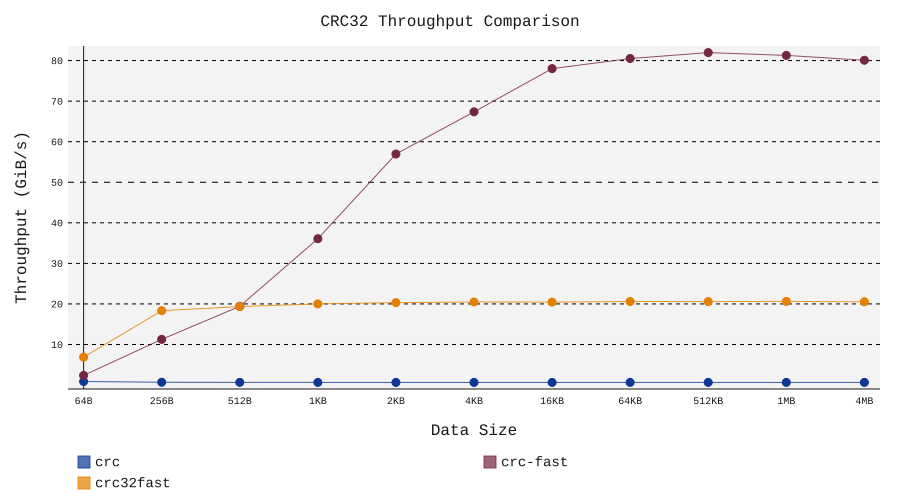
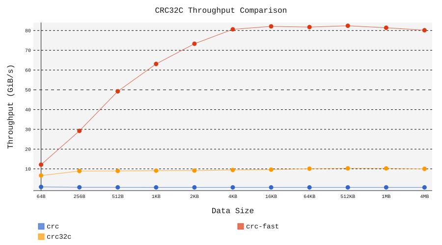

# CRC32 Benchmark Results

Generated: 2025-12-23 20:02:08

CPU: AMD Ryzen 9 9950X3D

## Summary

This report compares the throughput of various CRC32 implementations in Rust.

### Crates Tested

| Crate | Description |
|-------|-------------|
| [`crc`](https://crates.io/crates/crc) | Generic CRC library (software, table-based) |
| [`crc-fast`](https://crates.io/crates/crc-fast) | SIMD-accelerated, supports all CRC variants |
| [`crc32fast`](https://crates.io/crates/crc32fast) | SIMD-accelerated CRC32 |
| [`crc32c`](https://crates.io/crates/crc32c) | Hardware-accelerated CRC32C (SSE4.2/ARM) |

## CRC32

### Throughput (GiB/s)

| Crate | 64B | 256B | 512B | 1KB | 2KB | 4KB | 16KB | 64KB | 512KB | 1MB | 4MB |
|-------|-------:|-------:|-------:|-------:|-------:|-------:|-------:|-------:|-------:|-------:|-------:|
| **crc** | 0.87 | 0.69 | 0.67 | 0.66 | 0.65 | 0.65 | 0.65 | 0.64 | 0.64 | 0.64 | 0.64 |
| **crc-fast** | 4.25 | 11.03 | 19.95 | 36.47 | 58.69 | 68.42 | 78.22 | 80.02 | 81.68 | 81.36 | 79.96 |
| **crc32fast** | 6.83 | 18.27 | 19.41 | 19.99 | 20.30 | 20.46 | 20.43 | 20.57 | 20.61 | 20.61 | 20.50 |

## CRC32C

### Throughput (GiB/s)

| Crate | 64B | 256B | 512B | 1KB | 2KB | 4KB | 16KB | 64KB | 512KB | 1MB | 4MB |
|-------|-------:|-------:|-------:|-------:|-------:|-------:|-------:|-------:|-------:|-------:|-------:|
| **crc** | 0.85 | 0.69 | 0.66 | 0.65 | 0.65 | 0.65 | 0.65 | 0.64 | 0.64 | 0.64 | 0.64 |
| **crc-fast** | 23.31 | 41.39 | 72.28 | 72.12 | 79.94 | 79.50 | 81.48 | 81.77 | 82.09 | 81.45 | 79.77 |
| **crc32c** | 6.72 | 9.03 | 8.80 | 9.06 | 9.09 | 9.35 | 9.61 | 10.10 | 10.27 | 10.22 | 10.01 |

